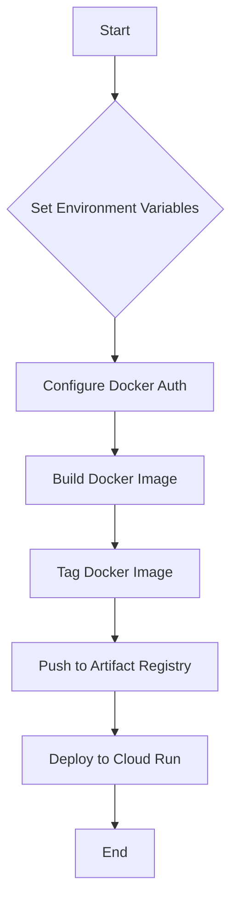

# VEO & Imagen Prompt Interface

This application provides a user interface for generating video and image content using Google's VEO and Imagen models.

## Deployment Flow



## Prerequisites

Before you begin, ensure you have the following installed and configured:

*   **Google Cloud SDK:** [Install and initialize the gcloud CLI](https://cloud.google.com/sdk/docs/install)
*   **Docker:** [Install Docker](https://docs.docker.com/get-docker/)

## Configuration

Export the following environment variables in your terminal, replacing the placeholder values with your specific GCP and application details.

```bash
export PROJECT_ID="[your-gcp-project-id]"
export REGION="[your-gcp-region]"
export REPOSITORY="[your-artifact-registry-repo]"
export IMAGE_NAME="[your-docker-image-name]"
export SERVICE_NAME="[your-cloud-run-service-name]"
```

## Deployment Steps

Follow these steps to deploy the application to Google Cloud Run.

### 1. Configure Docker Authentication

Configure Docker to use the `gcloud` command-line tool as a credential helper for Artifact Registry.

```bash
gcloud auth configure-docker $REGION-docker.pkg.dev
```

### 2. Build the Docker Image

Build the Docker image for the application.

```bash
docker build -t $IMAGE_NAME .
```

### 3. Tag the Docker Image

Tag the Docker image with the Artifact Registry path.

```bash
docker tag $IMAGE_NAME $REGION-docker.pkg.dev/$PROJECT_ID/$REPOSITORY/$IMAGE_NAME
```

### 4. Push the Docker Image

Push the tagged image to your Artifact Registry.

```bash
docker push $REGION-docker.pkg.dev/$PROJECT_ID/$REPOSITORY/$IMAGE_NAME
```

### 5. Deploy to Cloud Run

Deploy the application to Cloud Run using the image from Artifact Registry.

```bash
gcloud run deploy $SERVICE_NAME \
  --image=$REGION-docker.pkg.dev/$PROJECT_ID/$REPOSITORY/$IMAGE_NAME \
  --region=$REGION \
  --platform=managed \
  --port=8501\
  --iap
```
### 6. To add access
```bash
gcloud beta iap web add-iam-policy-binding \
--member=user:{USER_EMAIL} \
--role=roles/iap.httpsResourceAccessor \
--region=$REGION \
--resource-type=cloud-run \
--service=$SERVICE_NAME